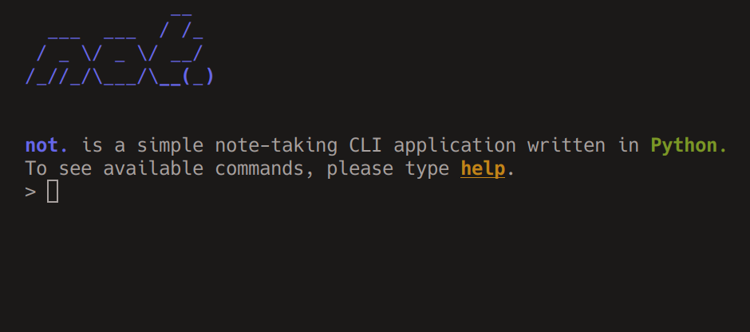

# not.

A simple note-taking cli application written in Python.

## Description

I've been looking for ways to take quick notes that I can use in my current workflow for a while. Although I tried a few applications, I couldn't find a faster way than opening an editor and writing something, but it's quite difficult to organize this process, so I'm developing Not. to make it easier to take notes for myself.

## Author

Emek Kırarslan
[@emekkirarslan](https://x.com/emekkirarslan)

## Version History

See [commit change]() or See [release history]()

## License

This project is licensed under the [GNU-GPLv3] License - see the LICENSE.md file for details

## Acknowledgments

Inspiration is mainly from:
* [nb](https://github.com/xwmx/nb/blob/master/nb)
Code snippets:
* All over the internet.
